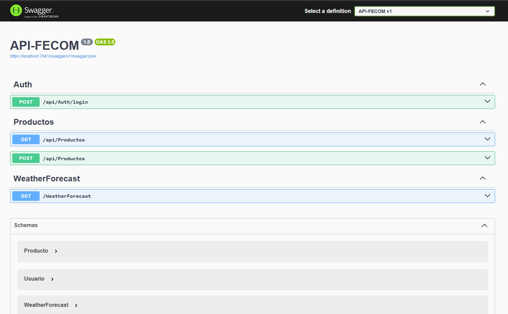
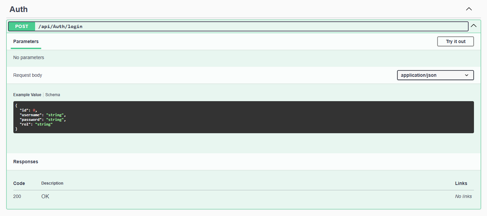
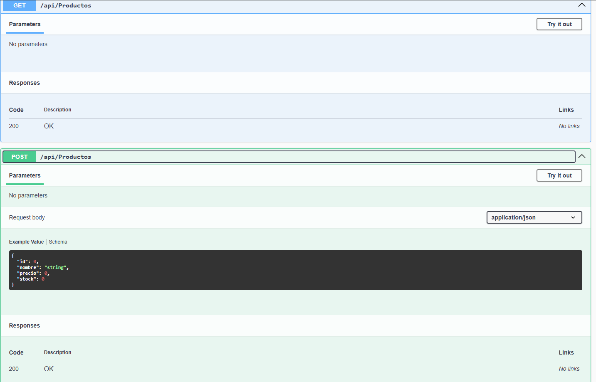

<div align="center">

# 🚀 API REST FECOM

### API profesional desarrollada con ASP.NET Core Web API + JWT + SQL Server

</div>

---

# 📌 Descripción

API REST desarrollada para la gestión de ventas e inventario de la empresa **FECOM**, implementando autenticación segura mediante JWT y arquitectura moderna para aplicaciones backend.

---

# 🛠️ Tecnologías Utilizadas

<p align="center">
  
</p>

- ASP.NET Core Web API
- C#
- Entity Framework Core
- SQL Server
- JWT Authentication
- Swagger
- LINQ

---

# 🚀 Funcionalidades

✅ Autenticación JWT  
✅ Login seguro  
✅ CRUD de productos  
✅ Gestión de usuarios  
✅ Endpoints RESTful  
✅ Entity Framework Core  
✅ Swagger Documentation  
✅ Arquitectura por capas  

---

# 📁 Arquitectura del Proyecto

```txt
API-FECOM
│
├── Controllers
├── Data
├── DTOs
├── Interfaces
├── Migrations
├── Models
├── Repositories
├── Services
├── Program.cs
└── appsettings.json
```

---

# 🔐 Autenticación JWT

La API implementa autenticación basada en tokens JWT.

## Flujo:
1. Usuario inicia sesión
2. API genera token JWT
3. Cliente consume endpoints protegidos
4. Validación automática del token

---

# 📦 Endpoints Principales

## 🔑 Login

```http
POST /api/Auth/login
```

### Body

```json
{
  "username": "admin",
  "password": "123456"
}
```

---

## 📦 Productos

### Obtener productos

```http
GET /api/Productos
```

---

### Crear producto

```http
POST /api/Productos
```

### Body

```json
{
  "nombre": "Taladro",
  "precio": 250,
  "stock": 10
}
```

---

# 📸 Capturas

## 🔥 Swagger



---

## 🔐 Login JWT



---

## 📦 Endpoints Productos



---

# ⚙️ Configuración del Proyecto

## 1️⃣ Clonar repositorio

```bash
git clone https://github.com/josephblancoromero/API-FECOM.git
```

---

## 2️⃣ Configurar base de datos

Editar:

```txt
appsettings.json
```

Configurar:

```json
"ConnectionStrings": {
  "DefaultConnection": "Server=TU_SERVIDOR;Database=APIFECOMDB;Trusted_Connection=True;TrustServerCertificate=True;"
}
```

---

## 3️⃣ Ejecutar migraciones

```bash
Update-Database
```

---

## 4️⃣ Ejecutar proyecto

```txt
F5
```

---

# 🧩 Base de Datos

Entidades principales:

- Usuarios
- Productos

---

# 📚 Herramientas Utilizadas

- Visual Studio 2022
- SQL Server
- Swagger UI
- Git
- GitHub
- Postman

---

# 🎯 Objetivo del Proyecto

Este proyecto fue desarrollado con fines académicos y profesionales para fortalecer conocimientos en desarrollo backend utilizando ASP.NET Core Web API y autenticación JWT.

---

# 👨‍💻 Autor

## Joseph Blanco Romero

🎓 Estudiante de Ingeniería de Sistemas  
💻 Desarrollador ASP.NET Core MVC & Web API  
📍 Huancayo, Perú

---

# 📫 Contacto

- GitHub:
https://github.com/josephblancoromero

---
